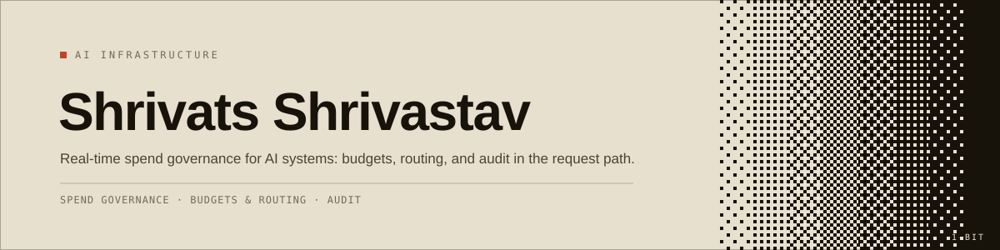
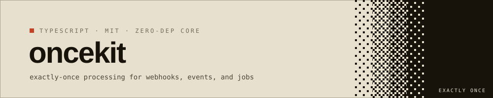
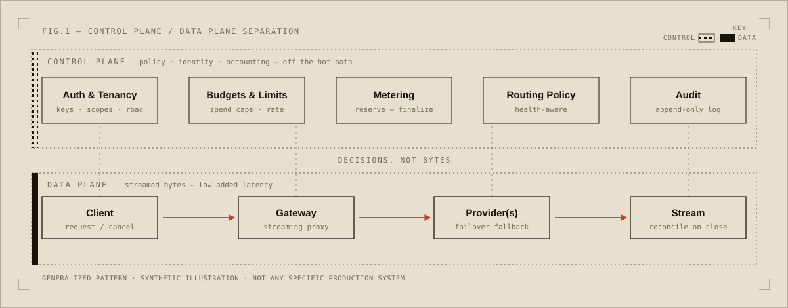
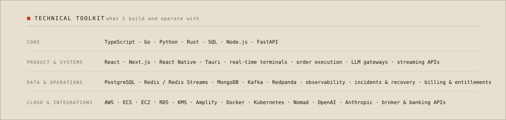

<!-- github.com/shrivats2 · profile README. Visuals are hand-authored SVG in /assets. -->

> *"Everything fails, all the time."*
> — Werner Vogels

I'm Shrivats. I build software systems, mostly the kind that sit quietly on a critical path and have to keep working. I care more about a system being correct and calm under load than about it being clever.

## What I like

- The unglamorous parts: what happens when a request is interrupted, a provider goes down, or the same event shows up twice
- Keeping AI systems reliable and affordable, not just working in a demo
- Real-time and event-driven systems
- Simple, boring designs that are easy to reason about at 3am

## What I can do

- Take something from a rough problem to running, deployed, and monitored
- AI usage and spend governance: budgets, routing, metering, and audit around model requests
- Reliability plumbing: idempotency, dead-letter recovery, reconciliation, graceful failure
- Real-time and event-driven systems, including order and financial flow
- Backend and infrastructure, deploys, and the boring production support that keeps it all up

## Something I built

**[oncekit](https://github.com/shrivats2/oncekit)** — every API tells you to "make your webhook handler idempotent." This is that advice as an actual library: dedupe, crash recovery via leases, and dead-letter handling in one call. Zero-dependency core, a durable Postgres store tested against real Postgres in CI, and an honest design doc on what "exactly-once" really guarantees. `TypeScript` · `MIT`

## How I think about it

A rule of thumb I keep coming back to: keep policy and accounting off the hot path, and let the actual work stream through with as little added latency as possible. The figure is a generic, made-up illustration, not any real system.

